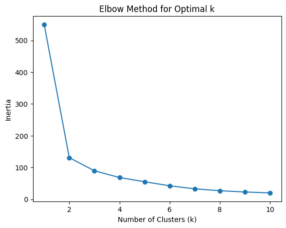
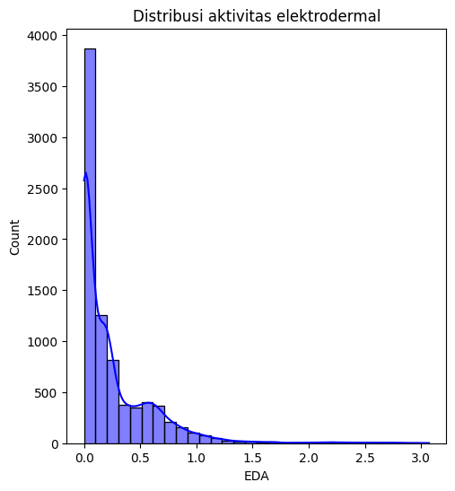
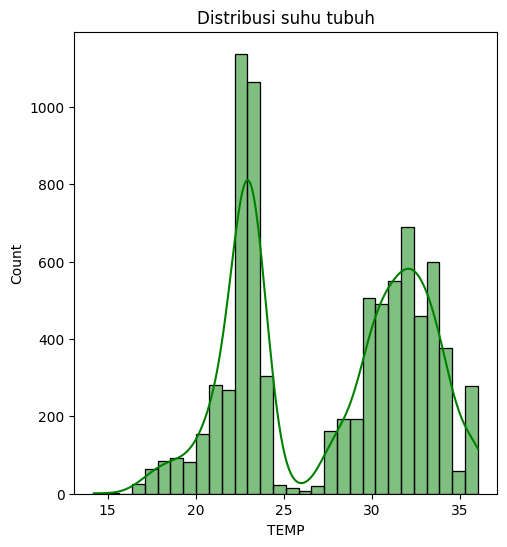
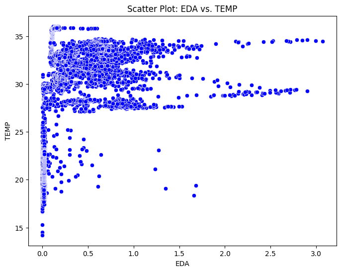
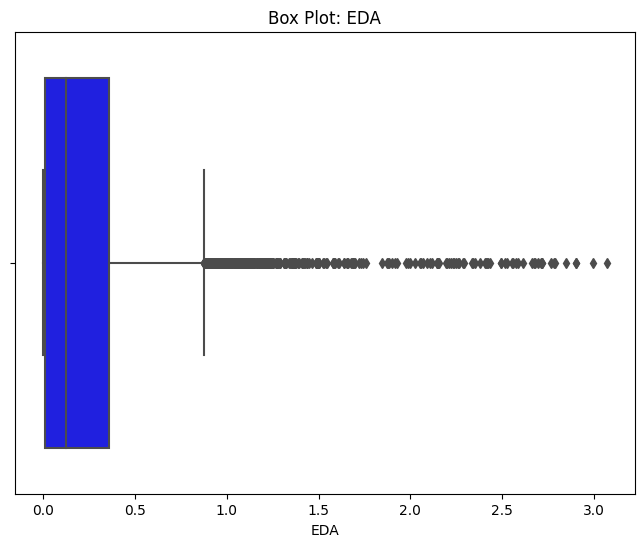
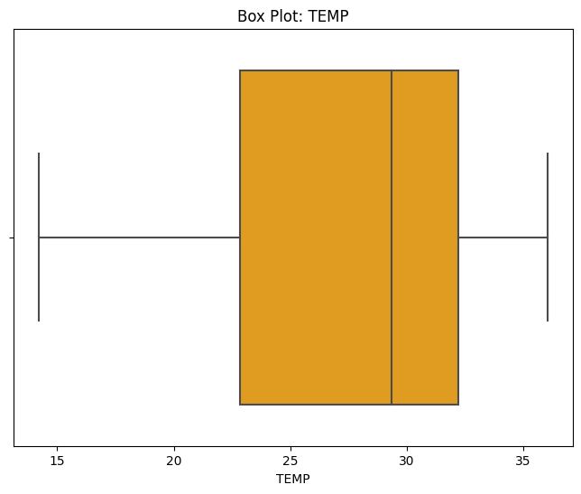
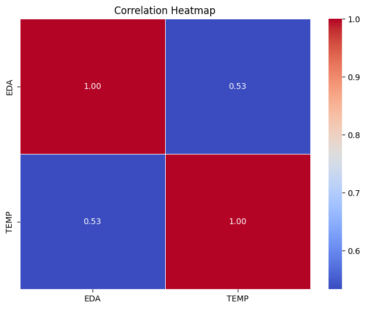
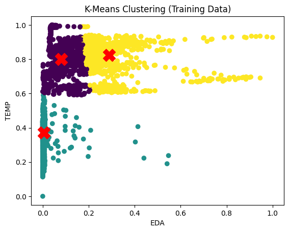
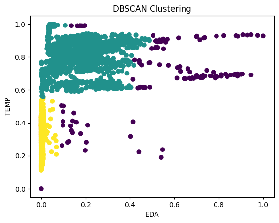

# Stress Detection Using Electrodermal Activity and Body Temperature Clustering

## Table of Contents
- [Introduction](#introduction)
- [Dataset](#dataset)
- [Data Pre-Processing](#data-pre-processing)
- [Exploratory Data Analysis](#exploratory-data-analysis)
- [Model and Training](#model-and-training)
- [Results](#results)
- [References](#references)

---

## Introduction
This project aims to analyze and cluster students' stress levels during exams using Electrodermal Activity (EDA) and body temperature (TEMP) data. Two clustering algorithms, K-means and DBSCAN, were applied to group students based on their physiological responses. The quality of clusters was evaluated using the silhouette score.

---

## Dataset
The dataset used in this project is from the study by Amin et al. (2022) titled "A wearable exam stress dataset for predicting grades using physiological signals." This dataset was collected using wearable devices that monitored students' physiological signals including Electrodermal Activity (EDA) and body temperature (TEMP) during an exam. It is part of the Wearable Exam Stress Dataset (WESAD) available on PhysioNet. You can download the dataset directly from PhysioNet using wget command like in the notebook.

- **EDA:** Represents the electrical conductance of the skin, which increases with stress levels.
- **TEMP:** Indicates the body temperature of the students during the exam.

---

## Data Pre-Processing
### Summary of Steps:
1. **Data Exploration:** Visualized the distribution and relationship between EDA and TEMP using histograms and scatter plots.
2. **Outlier Handling:**
   - Decided not to handle EDA outliers as it varies widely among individuals.
   - TEMP data showed normal distribution with no outliers.
3. **Feature Scaling:** Applied MinMaxScaler to normalize the data.
4. **Optimal Cluster Selection:** Used the Elbow Method to determine the optimal value of `k` for K-means clustering (k = 3).

---

## Exploratory Data Analysis
### 1. **Histogram**  
 
   - The histogram of EDA shows a positively skewed distribution, with most values concentrated between 0-1.5, reflecting variations in stress levels among students.  
   - The TEMP histogram demonstrates a bimodal distribution with peaks around 20-25°C and 30-35°C, possibly reflecting differences in external conditions or individual thermoregulation.  

### 2. **Scatter Plot** 

   - A scatter plot of EDA versus TEMP indicates a positive correlation between the two variables. As stress levels (EDA) increase, body temperature (TEMP) also tends to rise. This suggests that TEMP could be a supporting feature in identifying stress.  

### 4. **Boxplot**  
 
- From the boxplot, it can be seen that there are many outliers in the EDA feature. However, I decided not to handle these outliers because EDA varies from person to person and can be influenced by many factors Additionally, the silhouette score during the modeling stage was better when using the EDA feature as it is.
- From the boxplot, it can be seen that the body temperature of the students is normally distributed and there are no outliers.

### 5. **Correlation Matrix**  

   - The correlation matrix confirms a moderate positive correlation between EDA and TEMP. This insight justifies their joint use in clustering, as both variables contribute meaningful information about stress levels.  

---

## Model and Training
### Clustering Algorithms:
1. **K-means Clustering:**
   - Optimal `k` = 3 (determined using the Elbow Method).
   - Trained on scaled data.
   - Evaluated using the silhouette score.

2. **DBSCAN Clustering:**
   - Parameters: `epsilon = 0.05`, `min_samples = 25`.
   - Experimented with various combinations of epsilon and min_samples to achieve the best silhouette score.

---

## Results
### Silhouette Scores:
| Algorithm  | Silhouette Score |
|------------|------------------|
| K-means    | 0.9014           |
| DBSCAN     | 0.7100           |

### Cluster Visualization  
 
   - **K-means** shows distinct clusters with clear boundaries, indicating well-separated groups of students based on their physiological responses.  
   - **DBSCAN** highlights some overlapping points and noise, reflecting the challenges in distinguishing clusters using density-based methods for this dataset.  

### Observations:
- **K-means** produced better-separated clusters, indicating higher cluster quality.
- **DBSCAN's** lower score suggests challenges in grouping some data points, possibly due to overlapping clusters or noise in the dataset.

---

## References
1. Schmidt, P., et al. "Introducing the WESAD dataset for wearable stress and affect detection." Proceedings of the ACM on Interactive, Mobile, Wearable and Ubiquitous Technologies 2.3 (2018): 1-27.
